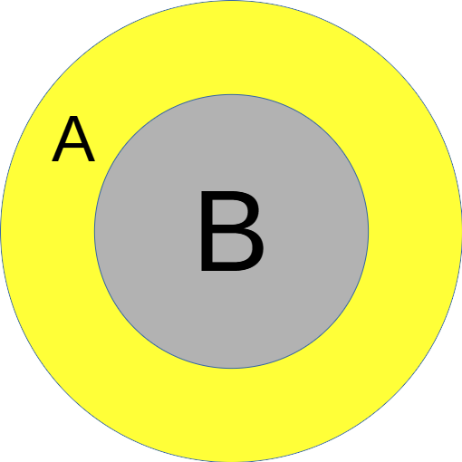
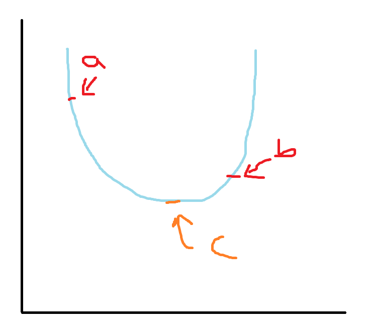
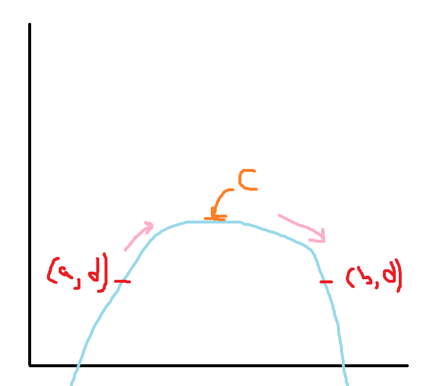
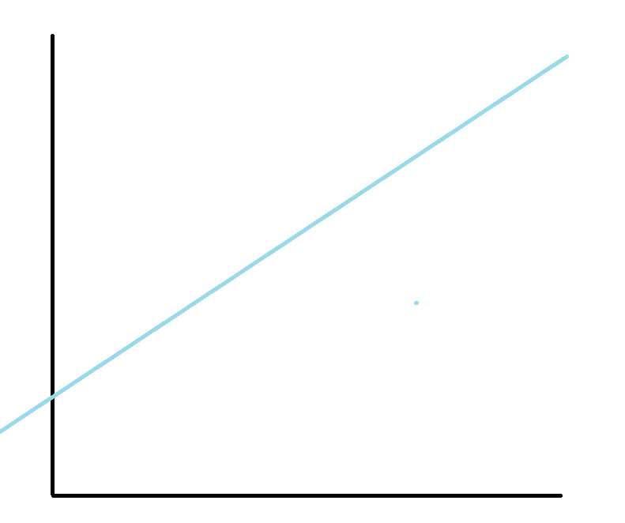

# TMUA Necessary and Sufficient

## Disclaimer

This work is entirely based off the [TMUA Logic Guide](https://www.admissionstesting.org/images/405848-test-of-mathematics-for-university-admission-notes-on-logic-and-proof-enhanced-test-specification-.pdf). I can thoroughly recommend reading said page if you want a full understanding of these problems.

## Quick look

If you already know what you are talking about, and just need a simple refresher, here you go:

| Short Form  | Long Form                       | Mathematical Notation   | English Form                        |
| ----------- | ------------------------------- | ----------------------- | ----------------------------------- |
| A if B      | If B then A                     | $A \Leftarrow B$      | A is sufficient for B               |
| A only if B | If A then B                     | $A \Rightarrow B$     | A is necessary for B                |
| A iff B     | (if B then A) and (if A then B) | $A \Leftrightarrow B$ | A is necessary and sufficient for B |

Truth table:

| A | B | A if B if B then A $A \Leftarrow B$ | A only if B If A then B $A \Rightarrow B$ | A iff B (if B then A) and (if A then B) $A \Leftrightarrow B$ |
| - | - | ----------------------------------------------- | ----------------------------------------------------- | ------------------------------------------------------------------------- |
| T | T | T                                               | T                                                     | T                                                                         |
| T | F | T                                               | F                                                     | F                                                                         |
| F | T | F                                               | T                                                     | F                                                                         |
| F | F | T                                               | T                                                     | T                                                                         |

Converse

: The swapping of A and B

| Statement   | Converse    |
| ----------- | ----------- |
| A if B      | B if A      |
| A only if B | B only if A |
| A iff B     | B iff A     |

Contrapositive

: The swapping and negating of A and B

| Statement   | Contrapositive      |
| ----------- | ------------------- |
| A if B      | not A if not B      |
| A only if B | not A only if not B |
| A iff B     | not A iff not B     |

In the above cases, they are all logically equivalent.

## Logic Gates

For logic gates, you only really need to remember the truth tables and they are that simple.

| A | B | A or B | A and B | not A |
|---|---|--------|---------|-------|
| T | T | T      | T       | F     |
| T | F | T      | F       | F     |
| F | T | T      | F       | T     |
| F | F | F      | F       | T     |

## Necessary and Sufficient

I believe the best way to consider these problems is to consider them as images, and then using these images, simply converting them into `if/only if/iff` statements.

Take for example, the following statement, `A is necessary for B` , what does this mean? If you don't have a conversion table this could be a difficult question to answer but if you translate it into an image in your head, this can become much easier. Let's take the following image:

Given we have the `B Circle` and the `A Circle`, what can you tell me about being in the `A Circle`?

You should notice that being inside the `A Circle` guarantees that we are in the `B Circle`. Do you know how we can say this in mathematical terms?

`If A then B` because if we are in the `A Circle` we must be in the `B Circle`; however, if we are in the `B Circle` we are not necessarily in the `A Circle`.

There is another term for this statement in maths: `A is sufficient for B`. Therefore `A is sufficient for B` is **logically equivalent to** `If A then B`.

Let's look at another circle:

You should notice now that this circle has "swapped B and A", in maths we call this the **converse** of the above statement. Let's take the above statement `A is sufficient for B` and look at its converse: `B is sufficient for A` (because we must be in the `A Circle` if we are in the `B Circle`). Therefore, the statement must be logically equivalent to `If B then A`.

But, what if I asked you to write this statement in the form `A ... B`. How would you go about doing that?

 An alternative way of writing the above circle in English would be: `We need A to be true, if we want any chance of B being true`. In maths we call this `A is necessary for B.`

> Note: there is then another statement: `A is necessary and sufficient for B` , this is the same as saying `(A is necessary for B) and (A is sufficient for B)` which is logically equivalent to `(A if B) and (B if A)` `->` `A iff B` `->` $A \Leftrightarrow B$

### How can I apply this?

The following is not true mathematical reasoning, unlike the full proofs set out in TMUA it does not entirely prove or disprove it, it is merely a way in which you can work things out, without needing to know the exact mathematical theory behind it. This method uses (by choice) badly drawn diagrams for the graphs because too many solutions in these papers are described by using a perfect graph (I am thinking of you $\sqrt{x} = \sin (3x)$) rather than a solution you could actually discover with pen and paper.

On first learning this I really struggled to understand how I could remember these, because these words and phrases seem to be plucked from thin air. The way I go about this, is that I simply remember one of these circles, and draw it whenever I get a question. Let's go through this with a question from TMUA (Paper 2 D413/02 November 2021 Q8):

> Consider the following statement about the polynomial $p(x)$, where $a$ and $b$ are real numbers with $a < b$:
>
> $$
> \begin{aligned}
> \text{(*) There exists a number } c \text{ with } a < c < b \text{ such that } p'(c) = 0.
> \end{aligned}
> $$
>
> Which of the following is true?
>
> A) The condition $p(a) = p(b)$ is necessary and sufficient
>
> B) The condition $p(a) = p(b)$ is necessary but not sufficient
>
> C) The condition $p(a) = p(b)$ is sufficient and not necessary
>
> D) The condition $p(a) = p(b)$ is not necessary and not sufficient

First of all, I would convert ABCD to the equivalent if statements, by drawing an image:

I then work out from the image what this is actually showing: `If A then B` : `A is sufficient for B`. I can then choose Option C, and substitute A and B from that.

In circle form this would now look like:

Let's rewrite ABCD in the `if statement` form:

> A) (If $(*)$ then $p(a) = p(b)$) and (If $p(a) = p(b)$ then (*))
>
> B) If $(*)$ then $p(a) = p(b)$
>
> C) If $p(a) = p(b)$ then (*)
>
> D) not (If $(*)$ then $p(a) = p(b)$) or not (If $p(a) = p(b)$ then (*))

Can you see how all these statements have their roots in (B) and (C) so we can forget about (A) and (D) for now. Instead, go through both B and C and try and:

> 1. Think of a case where it works (True) [If you can't find one it is false]
> 2. Think of a case where it doesn't work (False) [If you can't find one it is true]

Let's start by decoding what (*) means: `There is a value of x named c inbetween a and b which is a turning point.`

In order to prove that an `if statement` is False, you must find a case when X is true and Y is false (given `if X then Y`)

Let's start with (B):

$$
\text{if } (*) \text{ then } p(a) = p(b)
$$

1. Find a case where it is True:

> 
>  
> Here (*) is true: $a < c < b$ and $p'(c)=0$
> And $p(a) = p(b)$
> Therefore it is an example where the statement is true ([if True then True] = True)

2. Find a case where it is False:

> 
>  
> Here (*) is true: $a < c < b$ and $p'(c)=0$
> But $p(a) \neq p(b)$
> Therefore it is an example where the statement is false ([if True then False] = False)

We can now say, for a fact, that (B) is False. Let's substitute the value of (B) into our previous list of ABCD:

> A) False and (If $p(a) = p(b)$ then (*))
>
> B) False
>
> C) If $p(a) = p(b)$ then (*)
>
> D) True or not (If $p(a) = p(b)$ then (*))

This means we can instantly discard (A) because False and Anything = False.

So we now have to possibilities:

> C) If $p(a) = p(b)$ then (*)
>
> D) True or not (If $p(a) = p(b)$ then (*))

Let's take a look at (C) because it is common to both statements:

1. Find a case where it is true:

> 
>  
> We say $p(a) = p(b)$, and then look at (*):
> For (*): $a < b < c$ and $p'(c) = 0$
> Therefore we have found a case where it is true.

2. Find a case where it is false:

> Now I can't think of a case where it is False, so I will now attempt to prove it to be true.

We know that $p(a) = p(b)$ therefore we can give this a variable name: $p(a) = p(b) = d$. Let's look at the cases in which a polynomial could arise:

#### Case 1: Strictly increasing

> 
>
> If the polynomial is (strictly) increasing from point (a, d), at some point it needs to start coming down in order to reach (b, d). Therefore, it must have a turning point (c).

#### Case 2: Strictly decreasing

>  
>
> If the polynomial is (strictly) decreasing from the point (a, d), at some point it must come up again to reach (b, d). Therefore, it must have a turning point (c).

### Case 3: Multiple turns

> 
>  
> In this case, the polynomial is going up and down randomly in between a and b, yet there are still possible values for c (in fact, there are even more possible values!).

### Case 4: Straight Line

> 
>  
> Take, for example, the graph $f(x) = 3$, $f'(x) = 0$ and therefore there is also the possibility of c existing.

### Case 5: Linear Line

> 
>  
> The points $p(a) = p(b)$ can't exist on this graph because it is not curved or flat. Moreover, if we differentiate this, we will never get 0. Take for example: $f(x) = 3x + 1$. Try and find a value for x that is constant:
> $f(x_1) = f(x_2)$; $3x_1 + 1 = 3x_2 + 1$; $3x_1 = 3x_2$; $x_1 = x_2$. Therefore we know that the only possible value for $p(a) = p(b)$ is for $a = b$ but we know that $a < b$, therefore it is False for both sides. And `if false then false` is logically equivalent to `true`.

Therefore the answer is (c).

I hope this helped you understand the necessary and unnecessary, or maybe it helped you learn how to answer Q8 (I hope this might be true at least). I would thoroughly recommend going and reading the pdf attached at the top of this page, because it excellently describes how to use proofs (and it was written by Cambridge so it has to at least be ok ;)).
